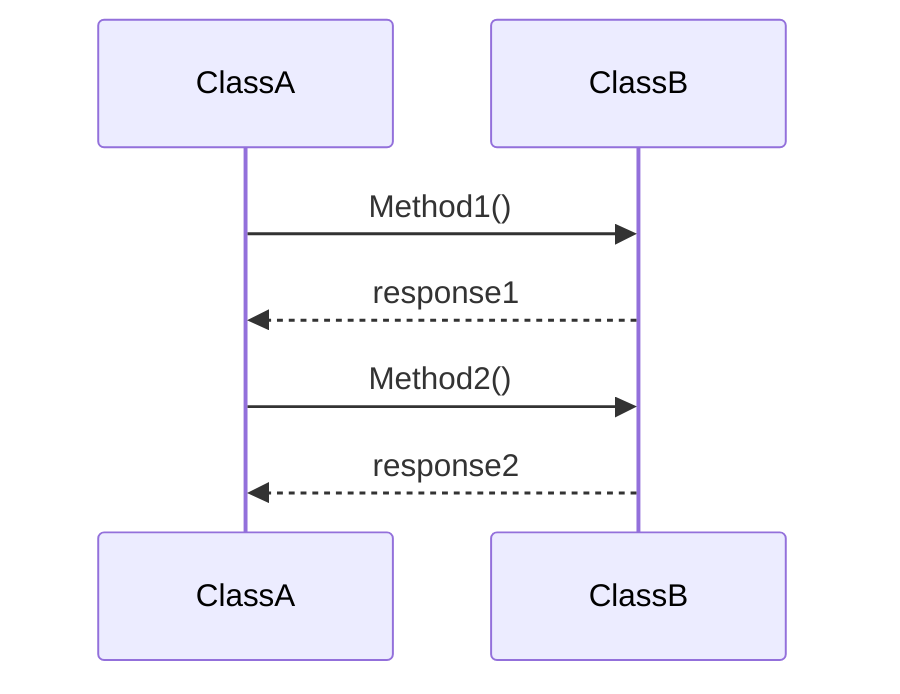

# Sequence Diagram

[Syntax Documentation](https://mermaid-js.github.io/mermaid/#/sequenceDiagram)

```mermaid

sequenceDiagram

ClassA->>ClassB: Method1()
ClassB-->>ClassA: response1
ClassA->>ClassB: Method2()
ClassB-->>ClassA: response2

```
