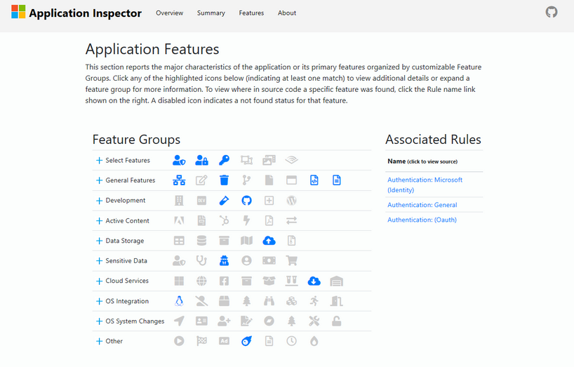

- Microsoft Application Inspector is a software source code characterization tool that helps **identify coding features of first or third party software components** based on well-known library/API calls and is helpful in [[Security]] and non-security use cases
- 
- Additionally, it includes a confidence indicator (and filter) as well as the ability to drill down to the code file area where the match was found.
  
# References
- https://github.com/microsoft/ApplicationInspector
- https://github.com/Microsoft/ApplicationInspector/wiki